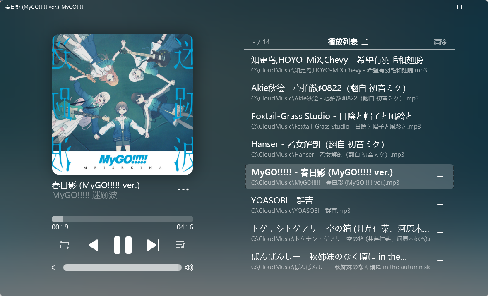

# fantastic-music-player

#### 介绍
界面看起来还不错的音乐播发器, 基于 bass.dll 开发
获取： https://gitee.com/ZYFDroid/fantastic-music-player/releases/



#### 软件架构

使用GDI绘制界面，使用Bass.dll作为引擎

#### 安装教程

1.  打开发行版页面
2.  下载最新的exe
3.  放到一个有音乐的文件夹双击打开

#### 使用说明

1.  建议慢慢摸索
2.  每个按钮都点点看
3.  使用很简单的

#### 如何编写音效文件

1.在音乐目录下创建.musicfx文件夹(前面有个点）

2.新建文本文档，后缀名为eq

3.填入以下内容

```
0.7
31,1,6
65,1,6
125,1,6
```
4.保存

5.你得到了一个音效文件，效果是重低音加强

6.第一行的数字是总体增益，范围是0-1，可以理解为音量，作用是调低音量防止破音

7.后面的是均衡器，第一个参数是频率中心，取值范围31-16000

8.第二个参数是八度范围，取值1-4，越大覆盖范围越广

9.第三个参数是增益，单位是dB，取值范围是-15 ~ 15

10.音量增益必须在第一行，文件里不能有多余空行，频谱修改可以有任意条

#### 参与贡献

1.  Fork 本仓库
2.  新建 Feat_xxx 分支
3.  添加不同模式的IPlaylistProvider实现以实现不同的播放模式（如果需要不同的播放模式，例如手动管理播放列表，或者扫描指定目录，或者通过指定方式获取播放列表）
4.  修改界面（如果觉得界面还能更漂亮）
5.  新建 Pull Request
